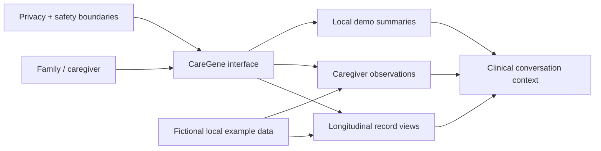
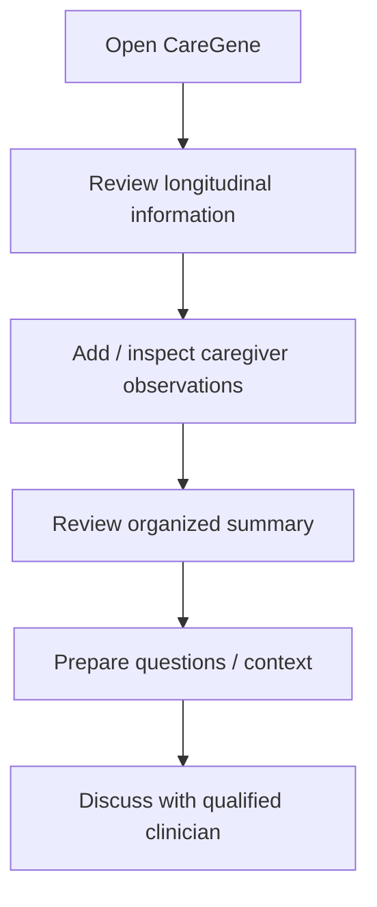
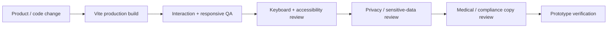

<div align="center">

# 🧬 CareGene

**A healthcare product concept for organizing longitudinal records, caregiver observations, and clinical conversations for rare-condition journeys.**


[Application workspace](./app) · [Detailed docs](./docs/README.md) · [Issues](https://github.com/Nischhalsubba/CareGene/issues)

</div>

> [!IMPORTANT]
> CareGene is a **product/design prototype, not a deployed medical service**. It must not be treated as medical advice, diagnosis, or proof of healthcare/privacy/compliance capabilities that have not been independently verified.

## Overview

CareGene explores how families and caregivers could organize complex health histories into a clearer longitudinal story for better preparation and communication. The current demo uses local example data and does not require sending health information or private API credentials to an external model from the browser.

| Audience | What matters most |
|---|---|
| Families / caregivers | Clear organization, understandable history and useful preparation |
| Designers | Calm information hierarchy, sensitive states, accessibility and trust |
| Developers | Client boundaries, privacy, build structure and safe data handling |
| Clinical / product reviewers | Medical wording, assumptions, limitations and verification |

<details open>
<summary><strong>🏗️ Interactive application architecture</strong></summary>



</details>

## User flow



## Repository structure

```text
CareGene/
├── .github/workflows/
├── app/                 # Vite application workspace
│   ├── public/
│   ├── src/
│   ├── index.html
│   ├── package.json
│   └── vite.config.ts
├── docs/
│   └── README.md
└── README.md
```

## Developer start

```bash
cd app
npm install
npm run dev
```

Production build:

```bash
npm run build
```

Preview the build with `npm run preview` from the `app/` workspace.

## Design, privacy and safety principles

- Keep example patient information fictional and clearly separated from real records.
- Do not expose patient information, secrets or private API keys in browser code.
- Do not claim HIPAA compliance, encryption guarantees, model isolation or launch readiness without independent verification.
- Treat summaries as organizational aids, not diagnoses or clinical conclusions.
- Use readable typography, accessible focus states, reduced-motion behavior and clear status/error messaging.
- Require qualified clinical review before any future feature interprets real medical data.

## SEO and discoverability

Public concept pages may accurately describe CareGene with terms such as **health record organization, caregiver observations, longitudinal health history, rare-condition care coordination, healthcare product design, and family health information organization**. SEO copy must make the prototype status clear and must not imply validated medical outcomes, clinical accuracy, regulatory compliance or production availability.

## Quality flow



More implementation and safety detail lives in [`docs/README.md`](./docs/README.md).
