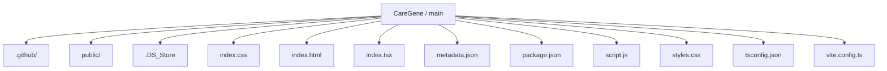
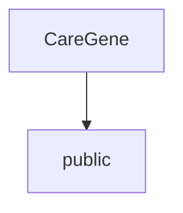
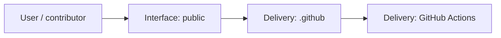
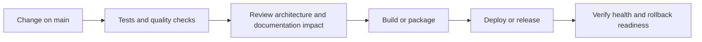
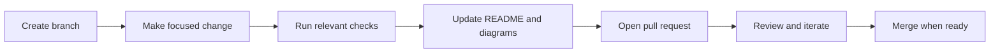

<!-- interactive-readme-standard:start -->

<div align="center">

# CareGene

**Branch-aware technical guide for [`main`](https://github.com/Nischhalsubba/CareGene/tree/main)**

<p>      </p>

<p>
  <a href="https://github.com/Nischhalsubba/CareGene/tree/main"><strong>Browse source</strong></a> ·
  <a href="https://github.com/Nischhalsubba/CareGene/issues"><strong>Issues</strong></a> ·
  <a href="https://github.com/Nischhalsubba/CareGene/codespaces/new?ref=main"><strong>Open in Codespaces</strong></a>
</p>

</div>

> [!IMPORTANT]
> This guide is generated from the files actually present on `main`. It links to detected source paths, preserves project-authored notes, and avoids claiming components that were not found.

## At a glance

| Item | Detected value |
|---|---|
| Purpose | A static healthcare AI product concept for organizing rare-condition records, caregiver observations, and clinical conversations. |
| Branch role | Default branch |
| Stack | Vite, TypeScript, CSS, HTML, JavaScript |
| Manifests | package.json |
| Prerequisites | Node.js |
| Delivery | GitHub Actions |
| License | No license file detected |

## Branch scope

This is the repository's default branch.


## Quick start

```bash
npm install
npm run dev
npm run build
npm run preview
```

### Configuration surface

- No committed environment example file was detected.

> Never commit secrets, private keys, production credentials, customer data, or unredacted infrastructure details.

## Repository map



| Responsibility | Detected source paths |
|---|---|
| Interface | [`public`](https://github.com/Nischhalsubba/CareGene/tree/main/public) |
| Delivery | [`.github`](https://github.com/Nischhalsubba/CareGene/tree/main/.github) |

## Website or application map



## Architecture and responsibility flow




## Quality, security, and operations

<table>
<tr>
<td width="33%" valign="top">

### Quality

- No conventional test directory was detected automatically.

Detected commands:
- `npm run dev`
- `npm run build`
- `npm run preview`

</td>
<td width="33%" valign="top">

### Security

- No dedicated security policy or automated dependency configuration was detected.

Review authentication, authorization, input validation, dependency updates, secret handling, and failure recovery before release.

</td>
<td width="34%" valign="top">

### Observability

- No dedicated observability integration was detected automatically.

Define useful logs, metrics, traces, alerts, and rollback signals for production-facing branches.

</td>
</tr>
</table>

## Delivery flow



### Automation detected

- [`.github/workflows/apply-interactive-readme.yml`](https://github.com/Nischhalsubba/CareGene/blob/main/.github/workflows/apply-interactive-readme.yml)

## Contribution flow



- Keep changes focused and explain architectural consequences.
- Run the checks relevant to the changed area.
- Update diagrams whenever routes, modules, data models, authentication, jobs, or delivery paths change.
- Add screenshots or recordings for visual behavior changes when useful.
- Use issues for reproducible defects and pull requests for reviewable changes.

## Ownership and support

| Topic | Source |
|---|---|
| Repository | [`Nischhalsubba/CareGene`](https://github.com/Nischhalsubba/CareGene) |
| Branch | [`main`](https://github.com/Nischhalsubba/CareGene/tree/main) |
| Ownership | No CODEOWNERS file detected |
| Contributing | Use the contribution flow above |
| Support | [Open or review issues](https://github.com/Nischhalsubba/CareGene/issues) |
| License | No license file detected |

<details>
<summary><strong>Documentation maintenance checklist</strong></summary>

- [ ] Purpose and branch scope are accurate.
- [ ] Setup and configuration commands still work.
- [ ] Repository, application, API, data, authentication, job, and deployment diagrams match the code.
- [ ] Tests, security controls, observability, and rollback behavior are documented.
- [ ] Links point to real files on this branch.
- [ ] No secrets or private operational details are exposed.

</details>

<!-- interactive-readme-standard:end -->

<!-- project-authored-notes:start -->
<details>
<summary><strong>Project-authored notes preserved from this branch</strong></summary>

<div align="center">

# 🧬 CareGene

### The Medical Memory AI for Rare Families

**A polished static healthcare/AI product landing page designed around trust, clinical memory, privacy, scroll storytelling, and emotionally clear product positioning.**


</div>

---

## ✨ Overview

**CareGene** is a static product landing page concept for a healthcare AI product positioned as a “medical memory” for families navigating rare conditions.

The page is designed to communicate a sensitive and high-trust product idea: helping families connect medical records, daily observations, clinical notes, symptom changes, and possible contradictions into a clearer memory layer that can support better conversations with healthcare professionals.

This repository is not just a generic healthcare website template. The actual codebase includes:

- a voice-first rare-disease product positioning
- a premium editorial hero section
- a simulated mobile product UI
- scroll-telling feature sections
- trust and privacy messaging
- clinical diary / timeline / records hub concepts
- Lucide iconography
- Lenis smooth scrolling
- GSAP + ScrollTrigger motion
- an import map prepared for Google GenAI usage
- custom typography using **Fraunces** and **Inter**

---

## 🧭 Table of Contents

- [Product Concept](#-product-concept)
- [Designer’s Perspective](#-designers-perspective)
- [Key Sections](#-key-sections)
- [Feature Breakdown](#-feature-breakdown)
- [Tech Stack](#-tech-stack)
- [Interaction & Motion System](#-interaction--motion-system)
- [Design System Direction](#-design-system-direction)
- [Trust, Safety & Medical Disclaimer](#-trust-safety--medical-disclaimer)
- [Repository Structure](#-repository-structure)
- [Installation](#-installation)
- [Usage](#-usage)
- [Deployment](#-deployment)
- [Quality Checklist](#-quality-checklist)
- [Suggestions for Improvement](#-suggestions-for-improvement)
- [License](#-license)

---

## 🧬 Product Concept

CareGene is presented as a **medical memory AI** for rare-condition journeys.

The landing page focuses on a real emotional and practical problem:

> Families often become the memory layer between doctors, reports, appointments, medications, symptoms, and daily observations.

The product concept proposes a tool that can:

- connect fragmented PDFs and medical notes
- track daily changes through voice logs
- detect contradictions between clinical notes and lived observations
- help parents organize records before appointments
- support safer, more transparent medical conversations

The page positions CareGene as a memory and organization layer, not as a replacement for clinical judgment.

---

## 🎨 Designer’s Perspective

This project is designed from the perspective of a designer who understands enough code to shape a polished product story.

The design challenge is sensitive: healthcare AI products need to feel helpful, safe, human, and trustworthy. They cannot feel like a random startup dashboard with exaggerated claims.

The design direction focuses on:

- warmth instead of cold medical UI
- trust instead of hype
- privacy instead of growth-at-all-costs messaging
- story-driven sections instead of generic feature cards only
- calm motion instead of flashy animation
- emotional clarity for parents and caregivers

The landing page uses a balance of editorial copy, product UI mockups, and trust messaging to make the idea easier to understand.

---

## 🧱 Key Sections

| Section | Purpose | UX Role |
|---|---|---|
| Navigation | Product, Trust, Mission links with sign-in/get-started actions | Gives structure and conversion paths |
| Hero | “Your Child’s Medical Memory for the Rare Journey” | Defines the product emotionally and clearly |
| Phone UI Mockup | Shows contradiction detection and monitoring | Makes the concept tangible |
| Problem Section | Snapshot trap, narrative tax, data silos | Explains the pain point |
| Scroll-Telling Section | Records hub, delta timeline, ambient diary | Explains product mechanics through motion |
| AI Widget | Simulated question/answer input | Demonstrates intelligence layer direction |
| Trust Section | Sentinel refusal, model isolation, zero retention, encryption | Builds confidence and safety |
| CTA Section | Roadmap and waitlist-style prompt | Drives final action |
| Footer | Product/company/legal links | Completes the landing page structure |

---

## 🧩 Feature Breakdown

### 🗂 Evidence-Linked Records Hub

The landing page describes a system that transforms fragmented PDFs and EHR-style records into a structured clinical knowledge graph.

This feature concept emphasizes:

- source provenance
- linked medical records
- granular sharing/privacy governance
- record redaction before sharing

### 📈 Delta Engine Timeline

The “Delta Engine” section explains clinical-shift detection.

It is positioned around tracking:

- lab trends
- medication changes
- symptom shifts
- contradictions between notes and observations

### 🎙 Ambient Clinical Diary

The ambient diary concept supports voice-based logging between appointments.

The idea is to let caregivers record small daily changes that may otherwise be forgotten by the time a specialist appointment happens.

### 🛡 Trust Layer

The trust section is especially important for healthcare AI.

It includes messaging around:

- refusing to overstate certainty
- model isolation
- zero-retention deletion behavior
- encryption and HIPAA-aligned direction

---

## 🛠 Tech Stack

| Layer | Technology | Purpose |
|---|---|---|
| Markup | HTML5 | Static page structure |
| Styling | Custom CSS | Visual system, layout, responsive UI |
| JavaScript | Vanilla JS | UI interactions and motion behavior |
| Icons | Lucide | Healthcare/product iconography |
| Typography | Fraunces + Inter | Editorial warmth + interface clarity |
| Smooth Scroll | Lenis | Smooth page flow |
| Animation | GSAP, ScrollTrigger, TextPlugin, ScrollToPlugin | Scroll-telling and transition effects |
| AI Import Map | `@google/genai` | Prepared Gemini/GenAI client-side import direction |

---

## 🎞 Interaction & Motion System

The page uses motion as part of the product story.

Current motion/interaction layers include:

- loading state on body
- organic cursor glow
- smooth scrolling
- fade-in sections
- fade-up hero visual
- scroll-driven feature storytelling
- sticky visual display that changes with text steps
- animated phone UI concept
- floating context cards
- voice FAB/wave motion
- AI widget interaction area

### Motion Principle

Because this is a healthcare concept, animation should feel calm, careful, and supportive. It should not feel like entertainment-first motion.

---

## 🎨 Design System Direction

### Typography

- **Fraunces** gives the page a warmer, human, editorial feeling.
- **Inter** keeps UI text readable and modern.

This pairing works well because the product is emotionally sensitive but still technical.

### Visual Tone

The visual direction can be described as:

- clinical calm
- family-centered
- warm AI
- soft product storytelling
- privacy-conscious
- editorial healthcare technology

### UI Patterns

- glass phone mockup
- pill labels
- trust badges
- scroll-telling panels
- soft cards
- icon-led feature blocks
- privacy/trust boxes
- strong final CTA

---

## 🛡 Trust, Safety & Medical Disclaimer

CareGene is a healthcare/AI product concept. Any public version should be careful with medical language.

### Important Disclaimer

This project should not be presented as medical advice, diagnosis, or treatment. Any AI-generated output should be reviewed by qualified healthcare professionals.

Recommended public-facing language:

> CareGene helps organize and summarize information for caregiver and clinician review. It does not replace medical diagnosis, emergency care, or professional clinical judgment.

### Content Safety Rules

- Do not claim the product diagnoses rare diseases.
- Do not imply AI output is always correct.
- Do not promise HIPAA compliance unless the actual infrastructure is audited and legally reviewed.
- Do not use real patient data in demos.
- Do not expose sensitive PHI in screenshots.
- Keep “AI refusal” and uncertainty messaging visible.

---

## 📁 Repository Structure

A typical structure for this static project:

```text
.
├── index.html        # Main landing page
├── styles.css        # Custom visual system and responsive styling
├── script.js         # Interactive behavior and animation logic
├── index.css         # Additional style entry if used by deployment/runtime
├── index.tsx         # Optional/experimental module entry referenced by HTML
└── README.md         # Project documentation
```

> Note: The actual static page currently references `script.js`, `styles.css`, `/index.css`, and `/index.tsx`. Before production deployment, confirm which entries are required and remove unused references if they are not part of the final build.

---

## 🚀 Installation

Clone the repository:

```bash
git clone https://github.com/Nischhalsubba/CareGene.git
```

Move into the project folder:

```bash
cd CareGene
```

Open `index.html` directly in a browser, or run a local static server.

Using Python:

```bash
python -m http.server 8000
```

Then open:

```text
http://127.0.0.1:8000/
```

---

## 🧪 Usage

Use this repository as a landing page foundation for:

- healthcare AI product concept
- rare-disease caregiver tool
- medical records organization product
- clinical diary concept
- privacy-first healthtech product
- product-design case study prototype

Before production use:

- review medical claims
- remove placeholder links
- connect real sign-in/get-started flows
- confirm privacy/legal copy
- configure AI functionality safely
- remove unused scripts or experimental entries

---

## 🌐 Deployment

This project can be deployed to any static hosting provider:

- GitHub Pages
- Cloudflare Pages
- Netlify
- Vercel
- static file hosting

No build step is required if all referenced files are included and paths are correct.

---

## ✅ Quality Checklist

### Design QA

- [ ] Hero message is clear in 5 seconds.
- [ ] Phone mockup is readable on desktop and mobile.
- [ ] Scroll-telling sections work smoothly.
- [ ] Trust messaging feels visible, not hidden.
- [ ] CTA section is clear and not too aggressive.
- [ ] Mobile spacing feels calm and readable.

### Technical QA

- [ ] `index.html` loads without console errors.
- [ ] `styles.css` loads correctly.
- [ ] `script.js` loads correctly.
- [ ] Lucide icons render.
- [ ] GSAP animations initialize.
- [ ] Lenis smooth scroll works or fails gracefully.
- [ ] Import map does not break unsupported environments.
- [ ] Unused `/index.css` or `/index.tsx` references are cleaned if unnecessary.

### Healthcare Content QA

- [ ] No diagnosis promise is made.
- [ ] No real patient data is used.
- [ ] HIPAA/security claims are legally reviewed before launch.
- [ ] AI uncertainty/refusal messaging remains visible.
- [ ] Medical disclaimer is included before public use.

---

## 💡 Suggestions for Improvement

<details open>
<summary><strong>Recommended next steps</strong></summary>

- Add a real privacy and medical disclaimer page.
- Add a waitlist/contact form backend.
- Add a safer AI interaction pattern with server-side API handling.
- Avoid exposing API keys in client-side code.
- Replace demo UI text with reviewed product copy.
- Add Open Graph metadata and favicon assets.
- Add responsive image optimization.
- Add reduced-motion support for all scroll animations.
- Add accessibility testing for keyboard and screen-reader use.
- Add screenshots/GIF preview to this README.

</details>

---

## 📜 License

This project is licensed under the **MIT License**. See the `LICENSE` file for more information.

---

<div align="center">

Designed with care for a sensitive healthcare product story.  
Built and maintained by **Nischhal Raj Subba**.

</div>

</details>
<!-- project-authored-notes:end -->
